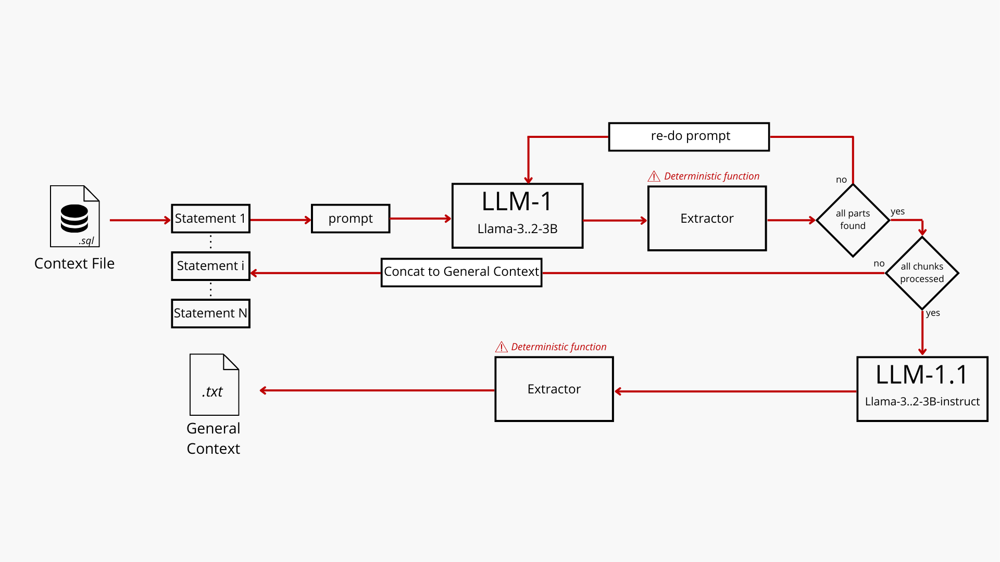

# 📊 DDL Optimization Pipeline using LLMs

## Table of Contents

- [📌 Project Overview](#-project-overview)
- [📁 Directory Structure](#-directory-structure)
- [🏗️ Project Architecture](#%EF%B8%8F-project-architecture)
- [📜 Prompts](#-prompts)
- [🚀 Getting Started](#-getting-started)
  - [Prerequisites](#prerequisites)
  - [Installation](#installation)
- [🧑‍💻 Usage](#-usage)
  - [Example Workflow](#example-workflow)
- [⚙️ Configuration](#%EF%B8%8F-configuration)
- [🔮 Future Considerations](#-future-considerations)
- [🤝 Contributing](#-contributing)
- [👨‍💻 Project By](#project-by)

## 📌 Project Overview  

### 📚 Background:

This is a project by Edam Hamza & Farah Elloumi realized for their tutored project at EY in collaboration with the Higher School of Communications at Tunis (SUP'COM).

In modern software development and data management environments, process efficiency and accuracy are crucial. Code testing and data structure optimization are often handled manually, which can lead to significant inconsistencies and inefficiencies. Integrating generative AI into these processes promises to radically transform the way companies approach the maintenance and evolution of their IT systems.

### 🌟 The project must include:

- **✅ Dynamic Change Validation**:
  - AI-powered validation system to assess the impact of proposed optimizations.
  - Ensures that all changes maintain or enhance overall system functionality without introducing regressions.

- **🔍 Comprehensive SQL Analysis**:
  - Extracts patterns from raw SQL statements to identify inefficiencies and optimization opportunities.
  - Generates a global analysis report to inform downstream optimization processes.

- **⚙️ Automated DDL Optimization**:
  - Leverages Large Language Models (LLMs) to refine DDL statements based on global analysis insights.
  - Provides targeted optimizations like column type adjustments, constraint updates, and key usage improvements.

- **🧬 System Must Function with Small LLMs**:
  - Implements measures and deterministic functions that validate every step of the way to make for inaccuracy.
  - Integrates a plethora of smaller LLMs each in charge of a separate task. (Similar to Agent Architecture)

- **🛠️ Modular and Extensible Design**:
  - Built with a modular architecture, allowing easy integration of additional models and optimization strategies.
  - Separates extraction, analysis, and optimization phases for future enhancements.

## 📁 Directory Structure

```plaintext
project/
│
├── main.py                   # Main script to run the pipeline
├── src/
│   ├── ddl_optimizer.py      # Module for loading llms
│   ├── sql_analyzer.py       # Module for optimizing DDL statements using LLM
│   ├── extractor.py          # Module for extracting SQL patterns and generating analysis
│   ├── prompts.py            # Module for generating prompts for LLM models
│   ├── llm.py                # Module for loading llms
│
├── utils/
│   ├── utils.py              # Utility functions used across modules
│
├── requirements.txt          # List of dependencies
├── README.md                 # Project documentation
└── .env                      # Environment variables for API keys (not included in repo)
```

## 🏗️ Project Architecture

### Global Architecture


🔍 **How it Works:**
1. **Context Generation Pipeline**: Analyzes SQL statements (SELECTs, INSERTS, etc) individually to generate a detailed summary of the tables involved, operation type and Column Filtration.
2. **Global Analysis & Context Transfer Pipeline**: Aggregates the insights from multiple SQL queries to generate a comprehensive analysis. This is done to detect any patterns and potential issues to yield recommendations for optimization (Indices, sharding, etc)
3. **DDL Optimization Pipeline**: Passes the global analysis along with individual DDL statements to a specialized LLM for optimization.

### Context Generation Under the Microscope 


🔍 **Measures to Make for Hardware & LLM Limitations**

As mentioned in the project objective, the system must be optimized to function on small LLMs. In our case, we have chosen to use:
- **Llama-3.2-3b:**
The Llama 3.2 collection of multilingual large language models (LLMs) is a collection of pretrained and instruction-tuned generative models in 1B and 3B sizes (text in/text out).
- **Llama-3.2-3b-instruct**
This is a version of the above model fine-tuned to handle instructions rather than day-to-day dialogue.
- **StarCoder2-3b**:
StarCoder2-3B model is a 3B parameter model trained on 17 programming languages from The Stack v2, with opt-out requests excluded.

The above architecture showcases the additional measures and functionalities we implemented to make for the shortcomings of these models. The latter consists mainly of deterministic functions like the **extractor** which uses complex regular expressions to detect if the model has responded to the task at hand in any way shape or form and to eliminate hallucinations. This allows us to have more **control over the length of the intermediary responses** by **extracting only relevant information** and formatting it in a compact way, and even to **re-do certain queries** where **none of the desired information was detected**.
Here's what it looks like:
```python
import re

text = """
### Tables Involved:
- **Conversations** (c)

# Operation Type:
- **SELECT**

**JOIN Conditions**:
- **None**

- **WHERE Conditions:**
- **c.id =?**
"""

def gen_pattern(section, last=False):
    sub_pattern = section.replace(" ", r"\s*")
    
    if last:
        # Use the pattern similar to where_pattern
        return re.compile(
            r"(?i)"
            fr"(?:[\*\*]*|\#{{1,3}})\s*{sub_pattern}\s*[\*\*]*:*\s*[\*\*]*\n*([\s\S]*?)(?=(?:\n\*\*|\n\#{{1,3}}|\Z))",
            re.VERBOSE | re.DOTALL
        )
    else:
        # Use the original pattern
        return re.compile(
            r"(?i)"
            fr"(?:[\*\*]*|\#{{1,3}})\s*{sub_pattern}\s*[\*\*]*:*\s*[\*\*]*\n*([\s\S]*?)(?=\n(?:-\s*|\*\*|\#{{1,3}}|\Z))",
            re.VERBOSE | re.DOTALL
        )

def extract_info(text, sub_patterns):
    # Define patterns for each section
    patterns = []
    extraction = ""
    # Generate patterns for each section
    for i, sub_p in enumerate(sub_patterns):
        last = (i == len(sub_patterns) - 1)  # Apply 'last' parameter only to the last element
        try:
            patterns += [gen_pattern(sub_p, last).search(text).group(1).strip()]
        except:
            patterns += ["N/A"] 
        extraction += f"{sub_p}: {patterns[i]}\n" 
    return extraction

# Create an extractor that detects the desired information
print(extract_info(text, ["Tables Involved", "Operation Type", "JOIN Conditions", "WHERE Conditions"]))

# ====== OUTPUT ======
"""
Tables Involved: - **Conversations** (c)
Operation Type: - **SELECT**
JOIN Conditions: - **None**
WHERE Conditions: - **c.id =?**
"""
```
## 📜 Prompts
We use the following prompts optimized to work best with the default models. Should you chose to upgrade, it shouldn't be a problem. However, a model of similar size may require some tweaking to adapt the prompts to it.
### Individual Description Prompt
```python
template = (
    "You are tasked with analyzing a SQL operation. "
    "read the SQL statement carefully and provide a clear, concise summary addressing the following questions in the format provided down below:\n"
    "- Which tables are involved?\n"
    "- What types of operations (e.g., SELECT, INSERT, UPDATE) are being performed?\n"
    "- Identify any JOINs, WHERE conditions, or filtering that could impact performance.\n\n"
    "Respond in bullet point format, adhering STRICTLY to the following response structure:\n"
    "- **Tables involved**: List the tables used in the query.\n"
    "- **Operation type**: Specify the type of SQL operation being performed.\n"
    "- **JOIN conditions**: Describe any JOIN operations (if applicable). If none, state 'None'.\n"
    "- **WHERE conditions**: Detail any filtering criteria specified in the query. If none, state 'None'\n"
    # "- **Column usage patterns**: Discuss the columns being used for filtering or conditions.\n\n"
    "### SQL Operation:\n"
    "{sql_statement}\n\n" 
    )
```
### Individual Description Prompt
```python
template = (
    "You have been provided with a summary of multiple SQL operations, describing the tables involved, operation types, JOIN conditions, and WHERE clauses.\n"
    "Your task is to analyze the entire set of descriptions to detect any common patterns, redundancies, or optimization opportunities that wouldn't be noticeable from analyzing the queries individually.\n"
    "Specifically, focus on identifying in the format provided down below:\n"
    "- Repeated access patterns to specific tables or columns.\n"
    "- Opportunities to optimize JOINs or filtering conditions.\n"
    "- Any indications of missing indexes or inefficient queries.\n"
    "- Insights that can inform optimizations for the underlying DDL (table definitions).\n\n"
    "### SQL Operations Summary:\n"
    "{combined_descriptions}\n\n"
    "Respond in bullet point format, adhering STRICTLY to the following response structure:\n"
    "- **Repeated access patterns**: List any repeated access patterns across tables or columns.\n"
    "- **JOIN optimization**: Identify any potential JOIN improvements.\n"
    "- **WHERE condition improvements**: Highlight any opportunities to enhance WHERE conditions.\n"
    "- **Suggested indexes**: Suggest any indexes that could improve performance.\n"
    )
```
### Individual Description Prompt
```python
## TBD
```
### Individual Description Prompt
```python
template = (
    "Optimize the following DDL query based on the provided SQL context. "
    "Focus on indexing, foreign key constraints, and data type optimization. "
    "Ensure to maintain the necessary relationships between tables.\n\n"
    "Context:\n{context}\n\n"
    "DDL Query:\n{sql_statement}\n\n"
    "Optimized DDL:\n"
    )
```
## 🚀 Getting Started

### Prerequisites
- **Python**: 3.8 or higher
- **Git**

### Installation

### Clone the Repository
```bash
git clone https://github.com/yourusername/ddl-optimization-pipeline.git
cd ddl-optimization-pipeline
```

### Create a Virtual Environment
```bash
python -m venv venv
source venv/bin/activate  # On Windows use `venv\Scripts\activate`
```

### Install Dependencies
```bash
pip install -r requirements.txt
```

### Set Up Environment Variables
```env
MODEL_ID=your-llm-model-id
OPENAI_API_KEY=your-openai-key
```
> [!NOTE]
> Note that this step only applies if you would like to change the LLMs you use for this project. We use HF's transformers so we do not have this. 

## 🧑‍💻 Usage
### Running the Pipeline
To run the complete DDL optimization pipeline:

```bash
python main.py
```
### Example Workflow
1. Prepare your SQL queries:
- Store them in a list, e.g., ddl_queries = ["CREATE TABLE ...", "ALTER TABLE ..."].
2. Generate Global Analysis:
- Use the sql_analyzer module to perform the analysis.
3. Optimize DDL Statements:
- The ddl_optimizer module optimizes the DDL statements based on the global analysis.
### Sample Code Snippet
```python
from src.extractors import extract_ddl_queries, extract_info_runnable, extract_ddls, extract_sql_context, extract_optimized_ddl
from src.llm import create_llm_pipeline, create_instruct_pipeline, create_llm_pipeline_starcoder
from src.sql_analyzer import SQLAnalyzer
from src.ddl_optimizer import DDLOptimizer
from src import prompts
from utils.utils import print_results, export_result_to_file, save_optimized_ddls
from config.config import MODEL_ID, INSTRUCT_MODEL_ID, SQL_FILE_PATH, MODEL_NAME, DDL_FILE_PATH, SQL_CONTEXT_FILE_PATH, OUTPUT_FILE

# Setup pipelines
hf_pipeline = create_llm_pipeline(MODEL_ID)
hf_instruct_pipeline = create_instruct_pipeline(INSTRUCT_MODEL_ID)
hf_starcoder_pipeline = create_llm_pipeline_starcoder(MODEL_NAME)

# Load SQL queries
queries = extract_ddl_queries(SQL_FILE_PATH)

# Load DDL queries
ddl_queries = extract_ddls(DDL_FILE_PATH)

#Load SQL context
sql_context = extract_sql_context(SQL_CONTEXT_FILE_PATH)

# Define extractors
extractor = extract_info_runnable(sub_patterns=["Tables involved", "Operation type", "JOIN conditions", "WHERE conditions"])
global_extractor = extract_info_runnable(sub_patterns=["Repeated access patterns", "JOIN optimization", "WHERE condition improvements", "Suggested indexes"])

# Initialize Analyzer
analyzer = SQLAnalyzer(hf_pipeline, hf_instruct_pipeline, extractor, global_extractor, prompts)

# Initialize Optimizer
optimized_ddls = DDLOptimizer(hf_pipeline, prompts)

# Run full pipeline
results = analyzer.invoke_full_pipeline(queries)

# Correct DDL Errors
corrected_ddls = [extract_optimized_ddl(ddl) for ddl in optimized_ddls]

# Save DDL
save_optimized_ddls(corrected_ddls, OUTPUT_FILE)

# Print context result
print_results(results, "SQL Analysis")

# Print DDL result
print("Le résultat est sauvegardé dans le fichier ddl_optimized.sql")

# Export result to file
export_result_to_file(results, "sql_analysis_results")
```
## ⚙️ Configuration
### Environment Variables
```python
# ./config/config.py
MODEL_ID = "meta-llama/Llama-3.2-3B" ## We use this model for individual operation description
INSTRUCT_MODEL_ID = "meta-llama/Llama-3.2-3B-instruct" ## We use this model for pattern detection
DDL_MODEL_ID = "bigcode/starcoder2-3b" ## We use this model for DDL optimization
SQL_FILE_PATH = './data/usecase.sql' ## We extract SQL statements out of a file and format them.
DDL_FILE_PATH = "./data/ddl.sql" ## We extract DDL statements out of a file and format them.
SQL_CONTEXT_FILE_PATH = "./sql_analysis_results_sample.txt" ## We extract SQL contexts out of a file and format them.
OUTPUT_FILE = "./optimized_ddl.sql" ## We save the optimized DDL in this file.
```
> [!NOTE]
> You can easily try out different models by changing these. The initialization templates reside in ```./src/llm.py``` if you'd like to have more customization options

## 🔮 Future Considerations
1. **Expansion of Context Components:**
Currently, the system focuses on operations performed on the database (e.g., insert-intensive, fetch-intensive tasks). However, expanding the context to include query logs could significantly enhance optimization capabilities.
By analyzing query logs, we can determine which queries are most frequently sent to the database and their execution frequency. This would provide deeper insights into which columns and tables require indexing or other optimizations, leading to a more targeted performance boost.
2. **Scaling Up with Larger LLMs:**
Due to hardware limitations, the project currently relies on smaller LLMs like Llama-3.2-3B and StarCoder2-3B. While effective, these models may miss deeper optimization opportunities.
Future iterations plan to leverage larger models, such as GPT-4o, to enhance the accuracy and depth of SQL analysis and DDL optimizations. This would provide richer insights and potentially unlock more advanced optimizations.
3. **Adding Testing Functionalities:**
We aim to implement comprehensive testing functionalities using tools like pylint for code quality checks and pytest for automated testing.
This will ensure robustness and consistency of the optimization pipeline, helping catch errors early and streamlining the development process.
4. **Measuring Optimization Effectiveness:**
A critical addition to the pipeline would be a way to measure the actual performance improvements from the LLM-driven optimizations.
This could include running optimized queries in a controlled environment and benchmarking them against the original queries to confirm both correctness and performance gains. By automating this validation process, we can better quantify the impact of our optimizations.

## 🤝 Contributing
We welcome contributions to enhance this project! Here's how you can get involved:

1. Fork the repository.
2. Create a new branch for your feature or bug fix.
3. Commit your changes.
4. Open a pull request with a detailed description.

## Project by
<a href="https://https://github.com/EdamH/DATA-DEFINITION-LANGUAGE-OPTIMIZATION-GENAI-LANGCHAIN/graphs/contributors">
    
</a>
